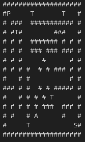

# 𖦹 maze-of-data
A maze exploration game using only C language. This project was developed for a 5th Semester Bachelors degree in Computer Engineering assignment (Data Structures and Algorithms).

---

### 💻 Execution
To compile and execute the application, run the following command in your terminal:

```bash
./maze
```
---

### 📝 Summary
The project is designed to create an automatic maze solver and simulator, that allows the user to load a maze from a text file and watch the program find and walk through the best path. The maze loading process reads dimensions, walls, start point, exit, treasures and traps, which are then processed using a DFS algorithm and a sorted linked list (backpack). The path is animated step by step on the screen.



This project was useful for learning iterative depth‑first search, dynamic data structures (linked lists), file I/O, and cross‑platform terminal animation techniques in C.

---

### ⚙️ Features
The user must provide the maze file name when prompted. After that, the program automatically executes the following steps:

1. "Carregar labirinto": reads the maze dimensions and grid from a .txt file, identifying walls (#), paths (), start (P), exit (S), treasures (T) and traps (A).

2. "Encontrar caminho": uses iterative Depth‑First Search (DFS) to find a valid route from start to exit, avoiding walls.

3. "Salvar solução": writes the sequence of coordinates (row, column) to solution.txt for later inspection.

4. "Simular caminhada": animates the player (P) moving along the path, step by step, with a 300 ms delay between frames.

5. "Gerenciar mochila": on each treasure (T), inserts a random value (1–100) into a sorted linked list; on each trap (A), removes the smallest treasure from the backpack.

6. "Exibir resultado final": when the exit (S) is reached, shows the total accumulated treasure value and terminates.

This project also includes some pretty handy tools for platform‑independent terminal clearing (cls/clear), millisecond delays (Sleep/usleep), and dynamic memory management for the backpack.

---

#### 👥Team Members

| Name                           | RA     |
|--------------------------------|--------|
| Guilherme Marques de Lima      | 248151 |
| Luis Fillipe de Medeiros Silva | 248370 |
| Vittorio Pivarci               | 248674 |
